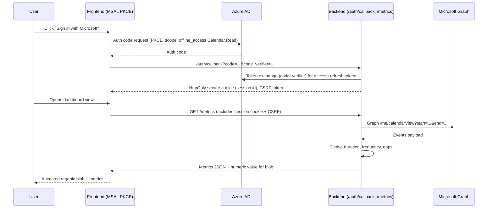

## Graph Dashboard MVP Architecture

### Overview
- Build a minimal yet production-ready slice that authenticates with Microsoft 365, fetches calendar metadata for the last 7 days, and renders a single numeric input as an animated organic shape on a dashboard.
- Host in an EU region (AWS or Azure) to satisfy data residency; keep services stateless for portability.

### Scope & Goals
- OAuth 2.0 (Microsoft identity platform) login with incremental consent for Calendar.Read.
- Backend service that exchanges auth codes for tokens, calls Microsoft Graph for a user’s calendar, derives: event duration, meeting frequency, and gaps between meetings over a 7-day window.
- Frontend (React or Vue) that renders the numeric input as a smooth, animated blob (Framer Motion or D3) plus basic calendar metrics.
- Clear extension points for later features (more signals, storage, RBAC).

### Non-Goals (MVP)
- No long-term data retention (compute metrics in-memory per request).
- No complex RBAC/ABAC; single-tenant user-level access.
- No offline sync; requires user session to fetch.

### System Context (Mermaid)
```mermaid
flowchart LR
    User[End User Browser] -->|OAuth 2.0 Auth Code| AzureAD[Microsoft Identity Platform]
    User --> FE[React/Vue SPA]
    FE -->|Metrics API /metrics| BE[Backend Service]
    BE -->|/token + /calendar events| Graph[Microsoft Graph API]
    subgraph EU Region (AWS/Azure)
      FE
      BE
      Cache[(Ephemeral cache)]
      Log[(Logs & Metrics)]
    end
```

### Component View (Mermaid)
```mermaid
flowchart TB
    subgraph Frontend_SPA[Frontend (SPA)]
        UI[Dashboard UI: organic shape, metrics cards]
        AuthClient[MSAL / PKCE Client]
    end

    subgraph Backend_API[Backend API]
        AuthAPI[/auth/callback]
        MetricsAPI[/metrics]
        GraphClient[Graph SDK wrapper]
        MetricsCalc[Metrics derivation]
        Cache[(Short-lived cache)]
    end

    AzureAD[(Azure AD)]
    Graph[(Microsoft Graph)]

    UI --> AuthClient --> AzureAD
    UI --> MetricsAPI
    MetricsAPI --> GraphClient --> Graph
    MetricsAPI --> Cache
    MetricsAPI --> MetricsCalc
```

### Auth & Data Flow (Mermaid Sequence)


### Backend Design
- Language/runtime: Node.js (Express/Fastify) or Python (FastAPI). Keep stateless; store session in signed HttpOnly cookies referencing server-side store (e.g., Redis in-memory cache).
- Auth:
  - Use OAuth 2.0 Auth Code with PKCE.
  - Scopes: `offline_access`, `Calendars.Read`.
  - Store refresh token server-side (encrypted at rest); rotate access tokens via refresh.
  - CSRF token bound to session for state-changing endpoints (even though MVP is read-only).
- Endpoints:
  - `GET /health` — liveness/readiness.
  - `GET /auth/login` — redirects to Azure AD authorize endpoint (includes PKCE challenge).
  - `GET /auth/callback` — handles code exchange, creates session.
  - `GET /metrics?start=<iso>&end=<iso>` — fetches calendar events for window (default last 7 days), returns:
    - `totalMeetings`, `totalDurationMinutes`, `avgDurationMinutes`, `medianGapMinutes`, `maxGapMinutes`, `minGapMinutes`, `meetingFrequencyPerDay`, `blobValue` (derived scalar).
- Graph access:
  - Prefer Microsoft Graph SDK; fallback to `fetch` if minimizing deps.
  - Use `/me/calendarView` with `startDateTime` and `endDateTime`; order by `start/dateTime`.
  - Pagination: handle `@odata.nextLink`.
- Metrics derivation:
  - Compute durations from `start/end`.
  - Gaps: sort events; difference between `start[i+1]` and `end[i]`.
  - Frequency: count per day; derive average.
  - Blob value: normalize composite score (e.g., 0–100) from load, balance, gaps.
- Caching:
  - Short-lived (e.g., 5–10 min) per-user window cache keyed by user+time range to reduce Graph calls.
- Rate limits/retries:
  - Respect Graph throttling headers; exponential backoff; cap retries; surface partial data with warning flag.

### Frontend Design
- Framework: React + Vite (or Vue + Vite).
- Auth: MSAL browser for PKCE; minimal popup/redirect flow. Store session via HttpOnly cookie; frontend holds only id token claims if needed for display.
- UI:
  - Input: numeric value from API; animate a fluid blob using Framer Motion or D3 with per-frame smoothing.
  - Metrics cards: show duration, frequency, min/median/max gaps; loading/error states.
  - Theme: light, minimal, responsive; a11y focus states and reduced motion toggle.
- State mgmt: Query library (React Query/RTK Query / Vue Query) for `/metrics`.

### Deployment (EU Residency)
- Cloud: AWS (eu-central-1/eu-west-1) or Azure (West Europe/North Europe).
- Frontend: Static hosting (S3+CloudFront with EU-only origins, or Azure Static Web Apps with EU region).
- Backend: AWS App Runner / ECS Fargate / Lambda or Azure App Service/Container Apps in EU region.
- Secrets: SSM Parameter Store / Secrets Manager (AWS) or Key Vault (Azure); never in repo.
- Cache/Session: AWS ElastiCache (Redis) or Azure Cache for Redis in same region.
- TLS: Managed certs; enforce HTTPS; HSTS.
- CI/CD: GitHub Actions pipeline with lint/test/build, deploy to staging (EU), then prod (EU).

### Security & Privacy
- Cookies: `HttpOnly`, `Secure`, `SameSite=Lax`; short session TTL; rotate session IDs after login.
- Token handling: Keep refresh tokens server-side only; encrypt at rest; least-privilege scopes.
- Input validation: Validate `start/end` ISO strings; cap window to 7 days.
- Logging: No PII in logs; sanitize Graph responses before logging; structured logs (request id, tenant, user id hash).
- Compliance: Data residency respected via EU services; document subprocessors.

### Observability
- Metrics: p95 latency for `/metrics`, Graph call success rate, cache hit rate, login success/fail.
- Tracing: Distributed trace around Graph calls.
- Logging: Structured JSON; error categories (auth, graph, validation, cache).
- Dashboards: Basic SLOs for availability and latency.

### Testing Strategy (MVP)
- Unit: Metrics derivation pure functions.
- Integration: Graph client with mocked Graph responses; auth callback happy/edge paths.
- E2E (lightweight): Cypress/Playwright for login + dashboard render with mocked API.

### Extensibility Notes
- Add storage later (Postgres) for history and trendlines; today compute on-demand.
- Introduce feature flags for advanced visualizations.
- Add RBAC/tenanting if moving to multi-tenant app registrations.
- Webhooks (Graph subscriptions) can be added later for push-based updates.

### Risks & Mitigations
- Graph throttling: Cache + backoff + warning flags.
- Token misuse: HttpOnly cookies, encrypted storage, minimal scopes.
- Performance: Pre-sort events once; streaming pagination handling.
- Residency drift: Pin regions; IaC with explicit region; block cross-region resources.

### Minimal Work Plan
1) Set up Azure AD app: redirect URIs, PKCE, scopes, client secret (server), enable tokens.
2) Scaffold FE (React/Vue) + MSAL; wire login/logout and token acquisition.
3) Scaffold BE with `/auth/login`, `/auth/callback`, `/metrics`; add Graph client.
4) Implement metrics derivation + cache + basic error handling.
5) Build dashboard UI with animated blob + metrics cards + loading/error states.
6) Deploy to EU staging; smoke test auth + metrics; then prod EU.

