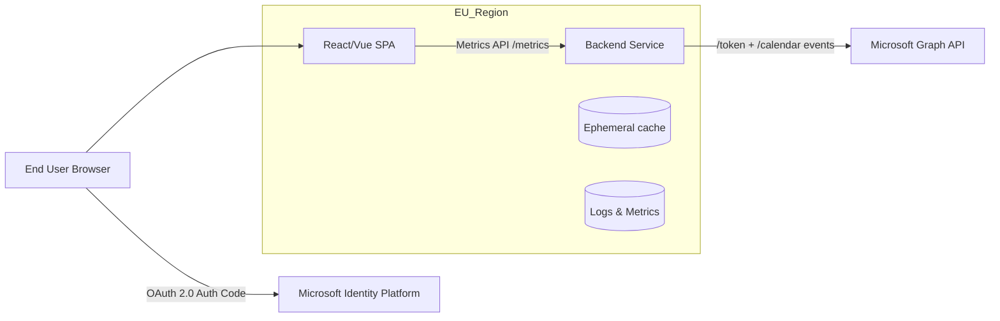
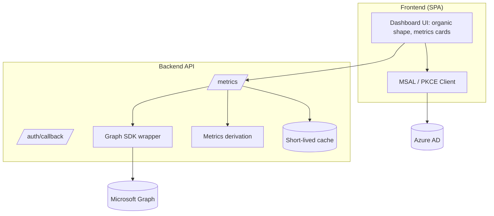
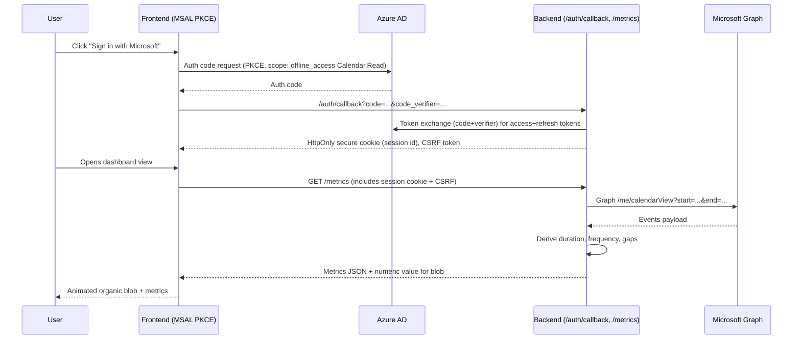

## Graph Dashboard MVP Architecture

### Overview
- Build a minimal yet production-ready slice that authenticates with Microsoft 365, fetches calendar metadata for the last 7 days, and renders a single numeric input as an animated organic shape on a dashboard.
- Host in an EU region (AWS or Azure) to satisfy data residency; keep services stateless for portability.

### Scope & Goals
- OAuth 2.0 (Microsoft identity platform) login with incremental consent for Calendar.Read.
- Backend service that exchanges auth codes for tokens, calls Microsoft Graph for a user’s calendar, derives: event duration, meeting frequency, and gaps between meetings over a 7-day window.
- Frontend (React) that renders the numeric input as a smooth, animated blob (Framer Motion or D3) plus basic calendar metrics.
- Clear extension points for later features (more signals, storage, RBAC).

### System Context (Mermaid)

### Component View (Mermaid)

### Auth & Data Flow (Mermaid Sequence)

### Backend Design
- Language/runtime: Node.js (Express/Fastify) or Python (FastAPI). Keep stateless.
- Auth: OAuth 2.0 Auth Code with PKCE; scope `offline_access Calendars.Read`; server exchanges code and holds refresh token.
- Endpoints: `/auth/login`, `/auth/callback`, `/metrics?start=<iso>&end=<iso>` (default last 7 days).
- Graph: use `/me/calendarView` with start/end; handle pagination; derive durations, gaps, frequency; return `blobValue` plus summary stats.

### Frontend Design (React)
- Framework: React + Vite.
- Auth: MSAL browser for PKCE; minimal popup/redirect flow.
- UI:
  - Input: numeric value from API; animate a fluid blob using Framer Motion or D3 with per-frame smoothing.
  - Metrics cards: show duration, frequency, min/median/max gaps; loading/error states.
  - Theme: light, minimal, responsive; a11y focus states and reduced motion toggle.
- State mgmt: React Query (or RTK Query) for `/metrics`.

### Deployment (EU Residency, Azure)
- Host frontend and backend in Azure West Europe or North Europe.
- Frontend: Azure Static Web Apps or Azure Storage + CDN (EU POP).
- Backend: Azure App Service or Azure Container Apps in EU region.

### Minimal Work Plan
1) Set up Azure AD app: redirect URIs, PKCE, scopes, client secret (server), enable tokens.
2) Scaffold FE (React/Vue) + MSAL; wire login/logout and token acquisition.
3) Scaffold BE with `/auth/login`, `/auth/callback`, `/metrics`; add Graph client.
4) Implement metrics derivation + cache + basic error handling.
5) Build dashboard UI with animated blob + metrics cards + loading/error states.
6) Deploy to EU staging; smoke test auth + metrics; then prod EU.

